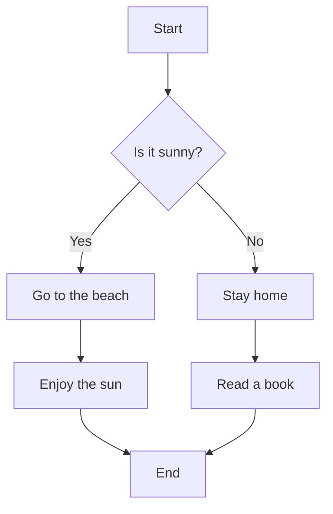
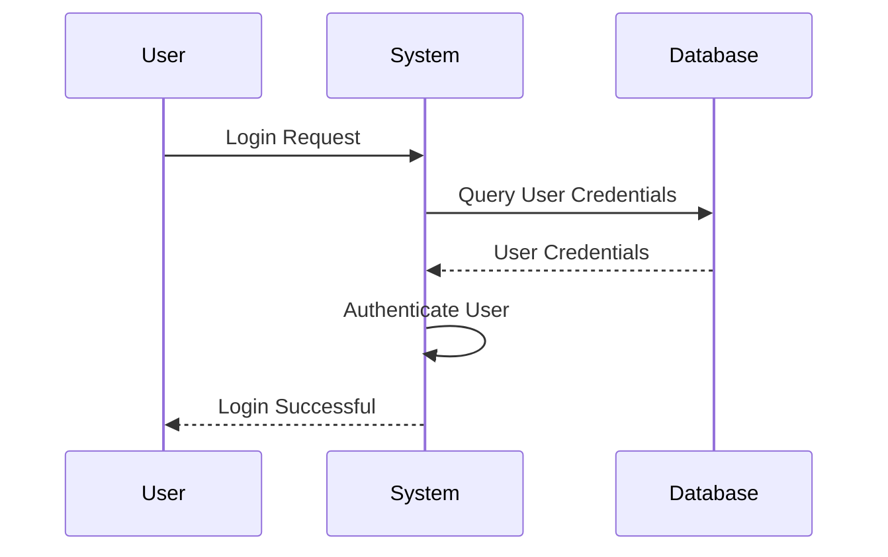
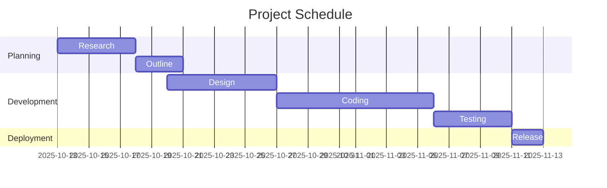
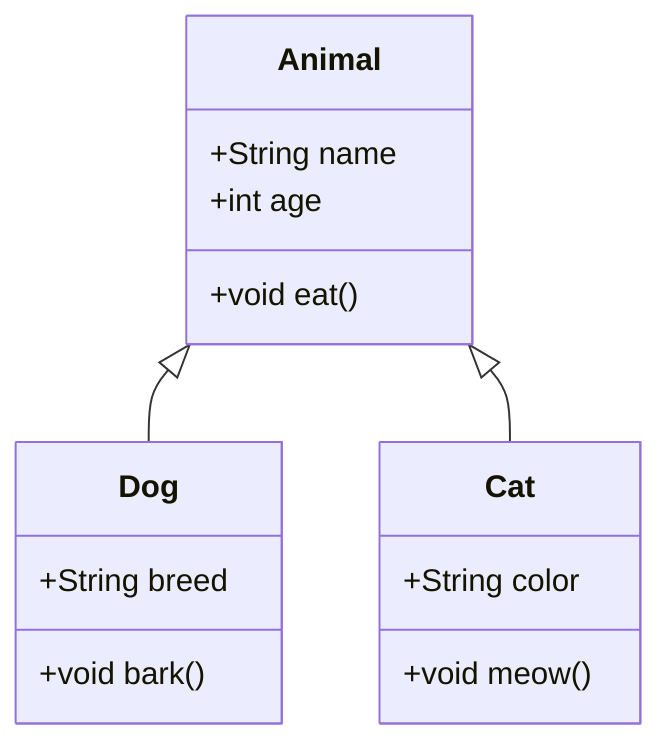
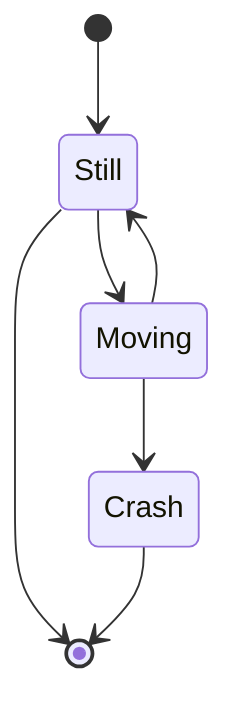
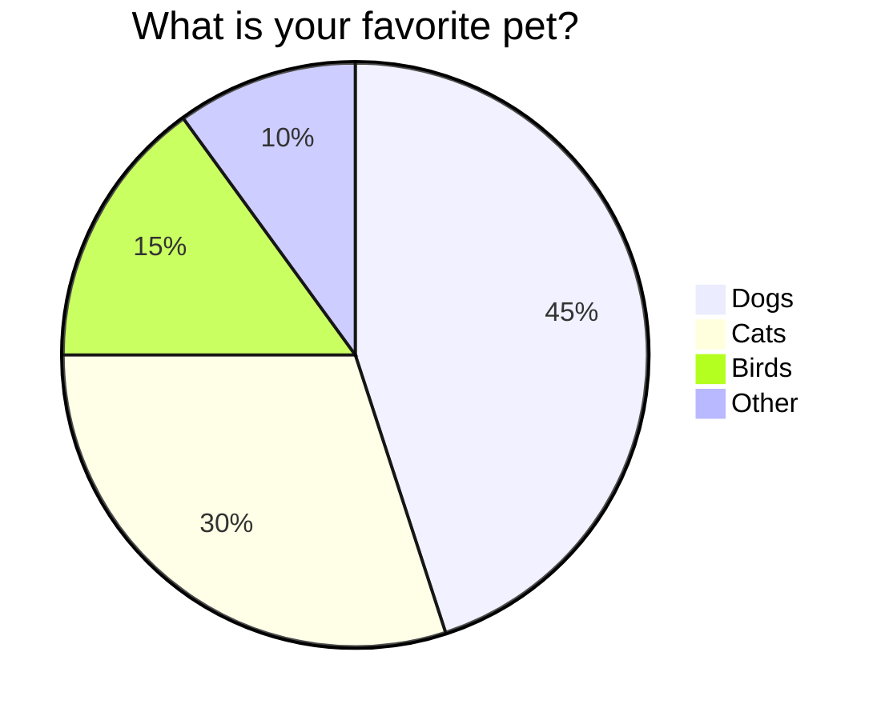
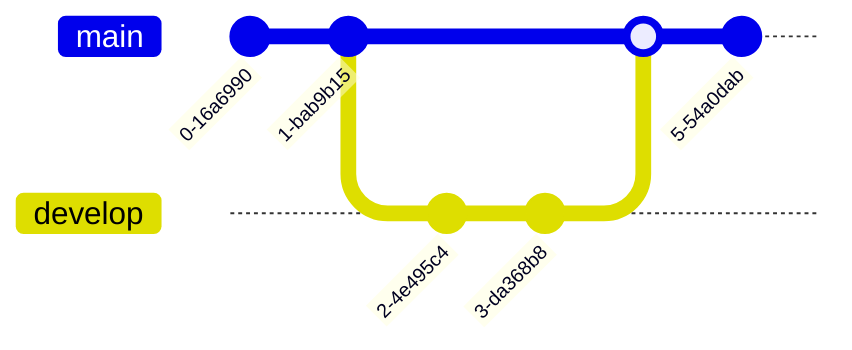
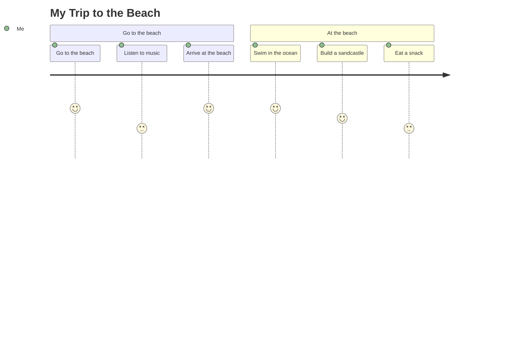
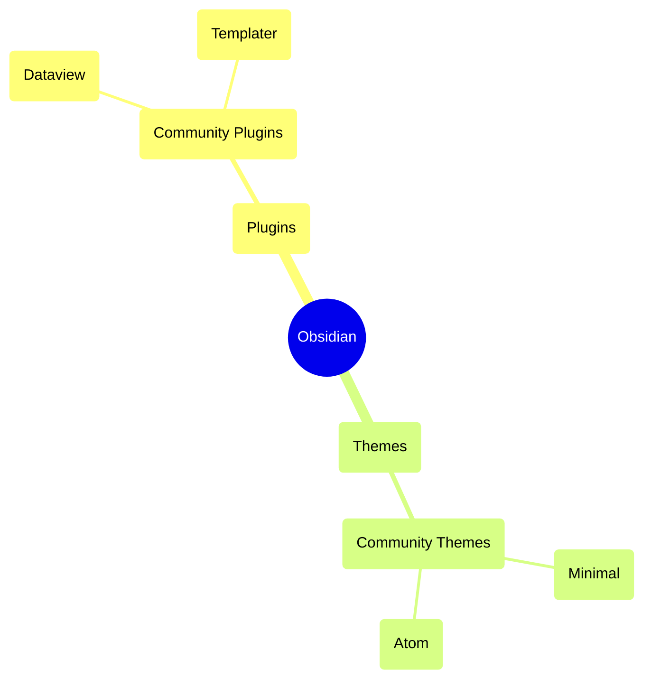
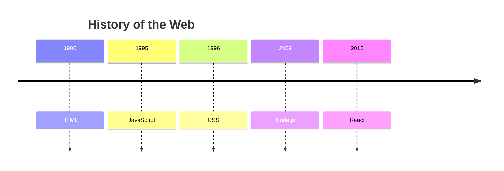

# 10 Examples of Mermaid.js Usage in Obsidian

Mermaid.js is a JavaScript library that allows you to create a variety of diagrams and charts using a simple, text-based syntax. Obsidian has built-in support for Mermaid, so you can embed these diagrams directly into your notes.

Here are 10 examples of Mermaid diagrams you can use in Obsidian:

### 1. Flowchart

Flowcharts are used to represent workflows or processes.

### 2. Sequence Diagram

Sequence diagrams illustrate interactions between different entities over time.

### 3. Gantt Chart

Gantt charts are useful for project management and scheduling.

### 4. Class Diagram

Class diagrams are used in software engineering to model the structure of a system.

### 5. State Diagram

State diagrams describe the behavior of a system and its transitions between different states.

### 6. Pie Chart

Pie charts are used to show the proportions of different categories.

### 7. Git Graph

Git graphs are used to visualize the history of a Git repository.

### 8. User Journey Diagram

User journey diagrams map out the user's experience with a product or service.

### 9. Mindmap

Mindmaps are used to visually organize information.

### 10. Timeline Diagram

Timeline diagrams are used to display a sequence of events in chronological order.

