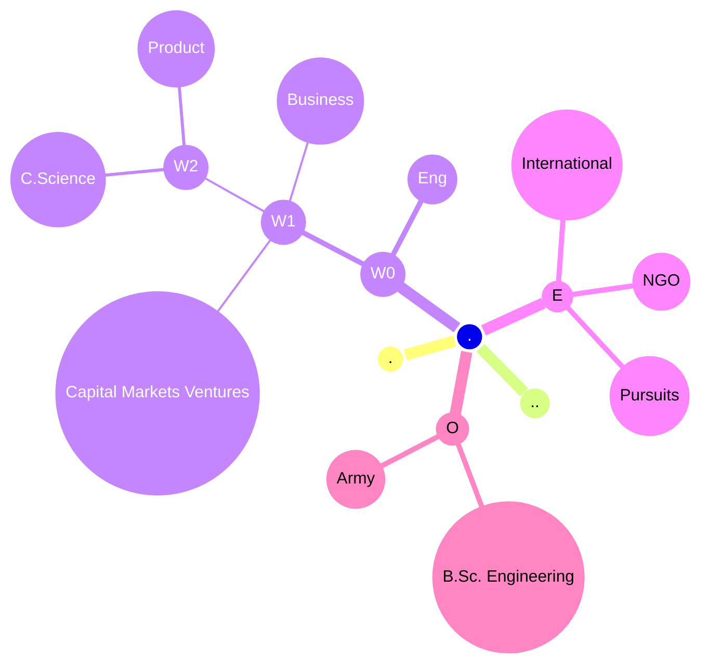
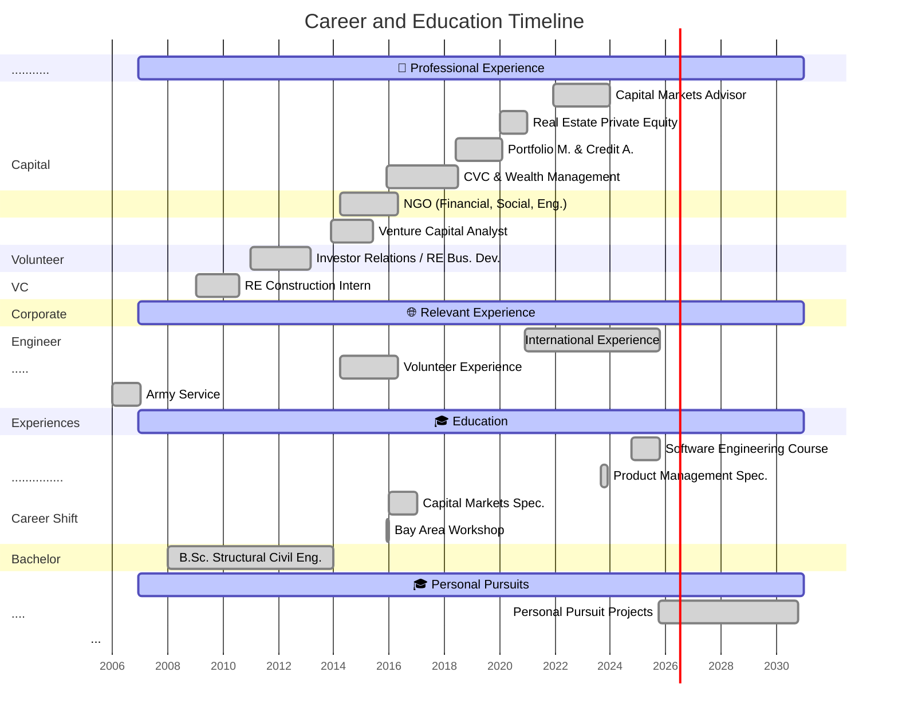
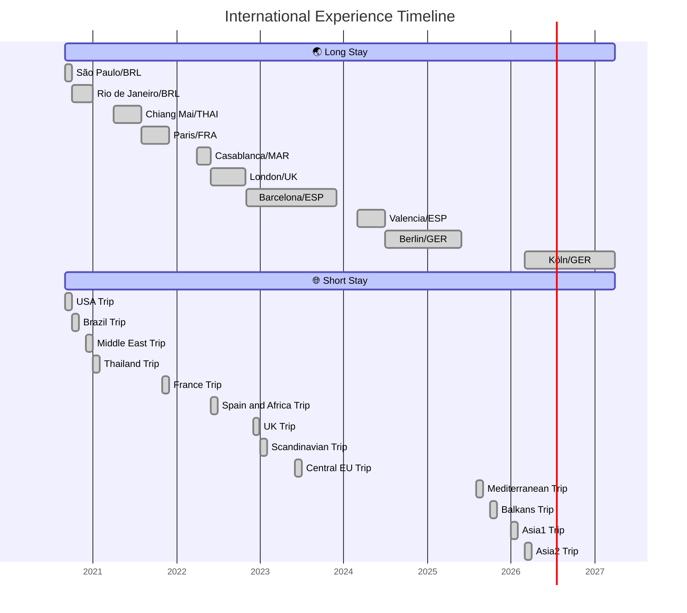

on---
layout: default
title: My HTML Page
---

# DIEGO NEPOMUCENO MARCOS 
**| Product n' Software Eng Std ✒️ | Venture Capital n' Portfolio Manager Analyst 🎩 | Civil Engineer B.Sc. 🏗️| @BERlin.de 🏛️ |**

*Portfolio & Curriculum*

---


<br>
<br>
<br>
>"*Cuando digo Diego, no digo 'digo', digo Diego*"
>—El Chavo del Ocho, Quico 
> 1978

<br>
<br><br><br>

🔻
<br>
<br>
<br>
<br>
<br>
<br>
<br>
<br>
## ABOUT

### ⚡ TL;DR
 >"Holding a B.Sc. as a Civil Structural Engineer, Investment Banker and Private Equity analyst for 10y; lived in 5 EU cities and moved over 170+ cities across 40+ countries; pivoting into Software n' Product Engineering; with Spanish and Brazilian roots based in Germany."

[📜Curriculum Vitae (pdf)](https://diegonmarcos.github.io/cv_pdf)


 

### ⛏️ WORKING ON
- Front-end Developments
- Agentic AI Orchestration
##
<br>
<br>
<br>

## PORTFOLIO
>
---

### 🎩 Capital Markets
>Structuring real estate deals in Investment Banking, managing substantial portfolios across mutual and structured funds, and handling the lifecycle of Private Equity and Venture Capital deals, with exposure to ESG and FinTech.

"*Risk comes from not knowing what you're doing.*" 
— Charlie Munger | Warren Buffett (The Oracle of Omaha)
#### (+)
- **Investment Banking**
	* Structuring (Modeling and Due Diligence) of R$ 500Mi in MBS.
	* Structuring Mezzanine debt of R$ 100Mi.
	* Structuring BTS and Sales & Leaseback.
	* Structuring and Private Placement of 5 companies in the Retail and Technology sector R$ 50Mi.
	* Constitution of 5 funds. Total  R$ 1,000 Mi AuM. Offers 476/400.
	* Mortgage Backed Securities (CRI | 10 units | R$ 350 Mi NPV).
* **Portfolio Management**
	 * Exclusive Funds (FIM/FIDC/FIP | 10 funds | R$ 500 Mi AuM).
	 * MBS Funds (FII |2 funds | R$ 500Mi AuM).
	 * Private Credit Funds (FIM | 3 funds | R$ 350 Mi AuM).
	 * Perpetual Bank Debt (LF | 1 unit | R$ 200 Mi).
 * **Risk & Compliance**
	 * Structuring of the front, middle, compliance, and risk: elaborating processes and analysis criteria of an asset management company. 
	 * Risk Management: Credit Default Rate, Debt-to-Equity Ratio, VaR, non Liquid Asset Pricing, P&L, Liquidity Ratios, Liability Balance.
	 * Front Committees (watcher) and Risk/Compliance Committees(Director).
- **Private Equity**
	 * Structuring a Holding Company for One-Stop-Shop Real Estate Investment Banking Solutions.
	 * Land for Real Estate Development  (SPE, 1 unit,  R$ 200 Mi Sales).
- **Venture Capital / CVC**
	* Fund with R$ 200Mi AuM. Acquisition of 4 Startups focused on ESG.
	* Structuring companies: Asset, Mortgage Bank, and Credit Servicer.
### 💼 Business Development
> For 4 years in Real Estate Development working in the construction field, financial modeling, FP&A, and investor relations in a real estate developer company.

"*We are what we repeatedly do. Excellence, then, is not an act, but a habit.*"
— Aristotle (Frequently cited by Steve Jobs, Apple)" 
#### (+)
* **Real Estate Business Development / FP&A**
	* Launch of real estate developments – Sales R$ 750Mi.
	* Land for real estate business development – Sales R$ 500Mi.
	* Financial modeling, product & project management and construction follow-ups.
* **Investor Relations**
	* Follow-on and MBS/Private Debit – R$ 350Mi.

### 🏗️ Civil Engineering
>Design, Plan, Management, and Development Residential towers and emergency houses for poverty alleviation.

"*The important thing is not to stop questioning. Curiosity has its own reason for existing.*"
— Albert Einstein (Physicist)"
#### (+)
* **Construction Field**
	* Design, Plan, Management, and Development of 2 tower building.
	* Construction of 8 houses for emergency housing acting directly on the building field of each house.
* **Educational Projects**
	* Roads, Bridges, Water resources sites, Vertical Buildings and Damns.
### 👾 Computer Science
> Pursuing a career shift. A Software Engineer and a Full Stack Developer under development.

"*Talk is cheap. Show me the code.*" 
— Linus Torvalds (Creator of the Linux Kernel and Git)
#### (+)
* **DevOPS**
	* Github Actions and YAML settings for websites CI/CD.
* **Back-end**
	 * Data: Hash-map Techniques and Binary Trees.
	 * System: Atomic operations, Concurrent Algorithms, Semaphore/Mutex, WebServer.
	 * Algo: Leet Code
	 * Graph and Gaming: Ray Casting Computer Graphics Algorithms.
* **Front-end**
	* Responsive, mobile-first websites:  Bootstrap CSS and Vanilla JavaScript.
	* Dynamic, component-based applications: Tailwind CSS and Vue.js . (*ongoing*).
	* Dynamic, component-based applications: Tailwind CSS and React.js . (*ongoing*).
* **Data Science and Machine Learning**
	* Agent Coder: Langgraph  | TensorFlow/Pytorch | SQL/noSQL (*ongoing*).
	* Hedge Fund Macro Analysis and Portfolio Rotation: Numpy/Scipy | SQL (*ongoing*).
* **Cyber-security**
	* Cyber
### ✒️ Product Management and Design 
> Pursuing a career shift.Passionate by innovation, creative coding, disruptive design and chaos patterns.

"*Simplicity is the ultimate sophistication.*"
— Leonardo da Vinci (Inventor, artist, engineer)
#### (+)
- **Tech Product Management**
	* Product requirements, Positioning strategy, User discover.
	* Product requirements document (PRD/Spec) and Product Roadmap.
	* Manage a product lifecycle, and Run an Operational Sprint.

### 🌐 International Experience 
> For 5 years, travelled to 170+ cities over 40+ countries across 5 continents; lived in 5 European capitals.

"*A ship in harbor is safer, but that is not what ships are built for.*" — John A. Shedd"
#### (+)
**Long Stays**
* Studying and working remotely in 5 European cities: Berlin and Barcelona, London, Valencia, and Paris. 
* Also took long stays in: Rio de Janeiro, Casablanca, and Chiang Mai. 
- Born and raised in São Paulo, the 5th biggest city in the world.

 **Short Stays**
- Traveled over 170+ cities, 100+ NomadMania Regions, 40+ countries across 5 continents. 
- Visited: World Heritage Sites (50+), New Seven Wonder+Pyramids (3/8) and The Seven Natural WW (1/7).

**Languages**
- Conversation Level: Portuguese, English and Spanish.
- Intermediate Level: Galego. Beginner Level: Deutsche.
- Basic Knowledge: Catalán, French and Italian.

	``` mermaid
	gantt
    title International Experience Timeline
    dateFormat  YYYY-MM-DD
    axisFormat %Y

    🌏 Long Stay        :active, 2020-09-01, 2027-03-30
    São Paulo/BRL        :done, 2020-09-01, 2020-09-30
    Rio de Janeiro/BRL         :done, 2020-10-01, 2020-12-30
    Chiang Mai/THAI         :done, 2021-04-01, 2021-07-30
    Paris/FRA         :done, 2021-08-01, 2021-11-30
    Casablanca/MAR         :done, 2022-04-01, 2022-05-30
    London/UK         :done, 2022-06-01, 2022-10-30
    Barcelona/ESP         :done, 2022-11-01, 2023-11-30
    Valencia/ESP         :done, 2024-03-01, 2024-06-30
    Berlin/GER         :done, 2024-07-01, 2025-05-30
    Köln/GER         :done, 2026-03-01, 2027-03-30
    
    🌐 Short Stay        :active, 2020-09-01, 2027-03-30
    USA Trip        :done, 2020-09-01, 2020-09-30
    Brazil Trip        :done, 2020-10-01, 2020-10-30
    Middle East Trip        :done, 2020-12-01, 2020-12-30
    Thailand Trip       :done, 2021-01-01, 2021-01-30
    France Trip        :done, 2021-11-01, 2021-11-30
    Spain and Africa Trip         :done, 2022-06-01, 2022-06-30
    UK Trip        :done, 2022-12-01, 2022-12-30
    Scandinavian Trip        :done, 2023-01-01, 2023-01-30
    Central EU Trip        :done, 2023-06-01, 2023-06-30
    Mediterranean Trip        :done, 2025-08-01, 2025-08-30
    Balkans Trip        :done, 2025-10-01, 2025-10-30
    Asia1 Trip        :done, 2026-01-01, 2026-01-30
    Asia2 Trip        :done, 2026-03-01, 2026-03-30
    ```

### 🫂 NGO 
> For 2 years in a NGO worked on projects related to social development and the construction of emergency houses for people in extreme poverty.

"*To rank the effort above the prize may be called love.*" 
— Confucius"
#### (+)
* Construction of 8 houses for emergency housing acting directly on the work of each house.
- Logistics management for a construction event of 10 houses.
- Development of projects to meet the infrastructure needs of the communities and improvements in the design of the model house.


### 🎖️Army Service
>Graded as Second Lieutenant of Logistics Brigade, from the Army Reserve Officers' Training Corps for the Brazilian Army (CPOR/SP).

"*If you know the enemy and know yourself, you need not fear the result of a hundred battles."*"
—Sun Tzu, *The Art Of War (1963)* 
#### (+)
- Curriculum:
	- Lectures and courses on Command and Leadership Corps
	- Analysis of all codes, laws and norms that permeate the Army
	- Exercising logistics and control functions within the battalion
	- Camps with total immersion, focusing on instruction for wilderness survival in combat
	- Logistics designing, implementation and managing a maintenance workshop weapons and armored fighting
	 - Theoretical and practical instructions for the graduation of an Army Officer (Leadership & Command, Military Strategy & Tactics, Physical & Mental Resilience, Ethics & Law, Logistics & Operations)
	 - Specialization in Corps Ordnance (Maintenance, Logistics, Supply and Transportation)
	 - (1 year | 2,016 hours | São Paulo/Brazil)
	- https://instagram.com/cporsp_exercito


### 🌱 Personal Pursuits 
> Always seeking for a balanced variety of fulfilling experiences 

"*It is not death that a man should fear, but he should fear never beginning to live.*"
— Epictetus"
#### (+) 

- Interests: Modern Physics (Quantum and Particle), Global Macro, Mediterranean and Vegetarian Cooking, Backpacking, Jazzy Music, Wellness and Wellbeing.
 - Endurance Sports: Hiking, Rock Climbing, Cycling, Skydiving and Bungee Jump. 
 - Competition Sports: Tennis (5y), Handball (3y), Rugby (1y) and Waterpolo (1y). 
 - Mindfulness: Aikido, Yoga and Meditation.
 - Pursuing: Oceans Seven Endurance, pre-Tour de France cycling and Seven Summits hike.

##### My Bucket (Endurance)
 - 🪂 High Adrenaline Sports
 - 🏂 Adrenaline Sports
 - 🏔️ Nature Sports and Activities
 - 🥋 Martial Arts
 - ⚽️ Collective Sports
 - 🏃 Individual Sports
 
High Adrenaline Sports:
	- 🚵🏻‍♂️ Trail Moto | ☆☆
	- 🪁 Kitesurfing | ☆
	- 🪂 Skydiving | ☆
	- 🧗🏻‍♂️ Rock Climbing | ☆☆
	- 🏂🏻 Snowboarding | ☆
	- Bung Jump |
	- Wing Suit |
- Adrenaline Sports:
	- 🥾 Hiking | ☆☆☆
	- 🪂 Paragliding | ☆☆
	- 🏄🏻‍♂️ Wakeboard | ☆☆
	- 🛹 Skating  | ☆
	- Ocean Fishing |
- Nature Sports and Activities:
	- ☘️ Trekking  | 🔸
	- 🏕️ Camping | ☆☆☆☆
	- 🤿 Snorkeling | 🔸
	- 🏄🏻‍♂️ Surfing | ☆
	- 🎣 River Fishing  | ☆☆
	- ⚓ Scuba Diving | ☆☆
	- ⛵ Sailing  | ☆
- Martial Arts
	- 🥋 Aikido | ☆
	- 🥊Taekwondo | ☆
	- 🥷Kung Fu | 
	- Boxing |
- Collective Sports: 
	- Competitions: 
		- 🤾🏻‍♂️ Handball | ☆☆
		- 🏐 Volleyball | ☆☆
		- 🏉 Rugby | ☆☆
		- 🤽🏻‍♂️ Waterpolo | ☆
	- Hobby: 
		- ⚽ Futebol | ☆☆☆☆
- Individual Sports:
	- Competition level: 
		- 🎾 Tennis | ☆☆☆
		- 🏊🏻‍♂️ Swimming | ☆☆☆
		- 🚲 Cycling | ☆☆☆
		- 🏃🏻‍♂️ Running| ☆☆☆
		- 🚴🏻‍♂️🏊🏻‍♂️ Biathlon | ☆☆
		- Marathon |
		- Iron Man 70.3 |
	- Hobby: 
		- ⛳ Golf  | ☆
		- ⛸️ Ice Lake Skying | ☆☆

##### My Bucket 50 (things before 50)
- Topics:
	-  🌿 Personal Growth & Learning
	- 🌐 Travel & Adventure
	- 🌍 Health & Wellness
	- 💼 Career and Finance
	- ❤️ Relationship & Community
	- ✨ Creativity & Fun
- Age:
	 - 🌱 (By 30): Foundational goals for exploration and habit-building
	 - 🌳 (By 40): Deeper goals for mastery, reflection, and long-term planning
	 - 🍁 (By 50): Legacy goals focused on wisdom, giving back, and deep fulfilment


<br>
<br>
<br>

##
<br>
<br>
<br>
## CURRICULUM
>
---

### ⏳Timeline
###### Graphics



### 💼 Professional Experience
#### Capital Markets Advisor (Sr/Partner) 
>Description: Structuring deals and distribution with investors focused on the middle market - ECM R$ 60Mi / DCM R$ 120Mi.
##### (+)
* | DHGP Capital / PHI Capital / Engage Capital – São Paulo/Brazil
* Timeline: Dec/2021 ~ Dec/2023
* Duration: 2 years and 1 month
#### Real Estate Private Equity (Sr/Partner) 
> Description: Wealth Management, Private Equity and Real Estate funds focused on credit and equity – AuM USD 60Mi.
##### (+)
 - R Capital Asset Management (RTSC GROUP) – São Paulo/Brazil
* Timeline: Jan/2020 ~ Dec/2020
* Duration: 1 year
#### Portfolio Manager and Credit Analyst (Sr/Partner) 
> Description: Management of Real Estate Funds focused on Equity, Credit (FIDC/555) and Equity Funds (FIP) - AuM USD 60Mi
##### (+)
* | Hectare Capital AM (RTSC GROUP) – SP/Brazil
* Timeline: Jun/2018 ~ Jan/2020
* Duration: 1 year and 5 months
#### Corporate VC and Wealth Management (Sr/Partner) 
- Description: Structuring of companies for the holding company (Asset Management, Mortgage Bank, Credit Servicer, and DTVM companies). Wealth Management with focus on FIDC, FII e FIM – AuM USD 200Mi
##### (+)
- RTSC Participações Group (RTSC GROUP) – SP/Brazil
* Timeline: Dec/2015 ~ Jun/2018
* Duration: 2 years and 6 months
#### Financial, Social, and Engineering in NGO (Sr) 
> Description: Development of blue prints projects to meet the infrastructure needs of communities; Social research and social work implementation. Finance Reports.
##### (+)
* | TECHO NGO – São Paulo/Brazil
* Timeline: Apr/2014 ~ Apr/2016
* Duration: 2 years
#### Venture Capital Analyst (Jr) 
> Description: Management of Venture Capital funds (FIP and FMIEE) - Acquisition, Management, and Disinvestment; Companies focused on ESG - AuM USD 40Mi.
##### (+)
* | KPTL Investments – São Paulo/Brazil
* Timeline: Dec/2013 ~ May/2015
* Duration: 1 year and 6 months
#### Investor Relations Analyst (Jr) / Real Estate Bus. Dev. Analyst (Jr) 
> Description: Support for Buy/sell-sides analysts and Investors. Management of Real Estate Development Processes, Financial Modeling, and monitoring of project construction.
##### (+)
*  Tecnisa S.A – São Paulo/Brazil
* Timeline: Jan/2011 ~ Feb/2013
* Duration: 2 years and 1 month
#### Real Estate Construction Field Intern (Jr)
* Description: Financial Control and on-site management the execution of the construction of two-tower real estate development.
##### (+)
* Plano & Plano - Cyrela Group – São Paulo/Brazil
* Timeline: Jan/2009 ~ Jul/2010
* Duration: 1 year and 7 months
### 🌐 Relevant Experience
#### International Experience
> For 5 years in a Nomadic Personal Project, travelled to 170+ cities over 40+ countries across 5 continents.
##### (+)
- Timeline:
#### Volunteer Experience
> For 2 years in a NGO worked on projects related to social development and the construction of emergency houses for people in extreme poverty.
##### (+)
- Timeline: Apr/2014 ~ Apr/2016 (2 years). 
#### Army Service
- For 1 year studied as a cadet in Brazilian Army Intensive Preparation of Officers. Graded as Second Lieutenant of the Logistics Brigade, from the Army Reserve Officers' Training Corps (CPOR/SP).
##### (+)
- Timeline: Jan/2006 ~ Dec/2006 (1 year - 2,016 hours).
<br>
### 🎓 Professional Education
#### Software Engineering (Course) 
> Focus / Description: C/C++ programming: data structures, classic algorithm, UNIX processes, network architecture, system administration, object-oriented programming, client-server projects and computer graphics and gaming.
##### (+)
* | L’École 42 (42 School) – Barcelona/Espanha | Berlin/Germany |
* Timeline: October/2024 ~ Actual
* | 1 year / 3 years (total), 200 hours coding done|
#### Product Management (Course) 
> Focus / Description: Product requirements and positioning strategy, User Discovery, Product Requirements Document (PRD/spec) and Product Roadmap, Manage a Product Lifecycle, and Run an Operational Sprint.
##### (+)
- | Stanford School of Engineering – California/USA (remote) |
* Timeline: September/2023 ~ November/2023
* Duration / Credits: 10 weeks (60 hours), 3 ECTS/1.5 UScred
#### Capital Markets (Course) 
> Focus / Description: Macroeconomics, Market Research and Analysis, Financial and Business Analysis, Financial Modeling / Project Finance, Due Diligence, ECM / DCM structuring deals, Asset Pricing, Risk Management, and Portfolio Allocation.
##### (+)
* | Anbima – São Paulo/Brazil (remote) |
* Timeline: January/2016 ~ December/2016
* Duration / Credits: 1 year (500 hours), 50 ECTS/25 UScred
#### Civil Structural Engineering (B.Sc.) 
* Focus / Description: Civil Engineering Bachelor. Majors: Structural, Water and Transportation. Minors: Math and Physics.
##### (+)
* | Mackenzie Presbyterian University – São Paulo/Brazil |
* Timeline: January/2008 ~ December/2015
* Duration / Credits: 5 years (4,500 hours), 440 ECTS/240 USCred
### ⛓️‍💥 Relevant Education 
- **Macro Economics (Course)**
- **Silicon Valley Workshop and Vegas Conferences**
##### (+)
- a
##
<br><br>
<br>

<br>
<br>
<br>
## SKILLS
>
---
### 💾 Tech Stack

---
#### 👾 My Stack 

| Topic                                   | Rating  |   //   | Topic                                   | Rating  |
| :-------------------------------------- | :-----: | :----: | :-------------------------------------- | :-----: |
| **CS Concepts**                         |  **☆**  |        | **DevOps**                              |  **☆**  |
| &nbsp;&nbsp;&nbsp; - Data Structures    |    ☆    |        | &nbsp;&nbsp;&nbsp; - GitHub Actions     |         |
| **Back-End**                            |  **☆**  |        | **Database**                            |  **☆**  |
| &nbsp;&nbsp;&nbsp; - UNIX               |   ☆☆☆   |        | &nbsp;&nbsp;&nbsp; - SQL                |   ☆☆☆   |
| &nbsp;&nbsp;&nbsp; - Algorithms         |   ☆☆☆   |        | &nbsp;&nbsp;&nbsp; - NonSQL             |   ☆☆☆   |
| &nbsp;&nbsp;&nbsp; - Web Servers        |    ~    |        | **Data Science & ML/AI**                | **☆☆☆** |
| &nbsp;&nbsp;&nbsp; - Embedded Systems   |    ~    |        | &nbsp;&nbsp;&nbsp; - Numpy/Scipy        |    ☆    |
| &nbsp;&nbsp;&nbsp; - Graphic and Gaming |    ☆    |        | &nbsp;&nbsp;&nbsp; - TensorFlow/Pytorch |    ~    |
| **Front-End**                           | **☆☆☆** |        | &nbsp;&nbsp;&nbsp; - Langraph           |    ~    |
| &nbsp;&nbsp;&nbsp; - Html/CSS           |    ☆    |        |                                         |         |
| &nbsp;&nbsp;&nbsp; - Vanila.js          |    ~    |        |                                         |         |
| &nbsp;&nbsp;&nbsp; - Vue.js             |    -    |        |                                         |         |
| &nbsp;&nbsp;&nbsp; - React.js           |    -    | **//** |                                         |         |
| &nbsp;&nbsp;&nbsp; - Pandas             |         |        |                                         |         |

##### Icons
###### 🚀 DevOps

| SCRIPT                                       |                                                                                                                  |                                                  | VC/CI                                            |                                                                 | CONT                                             | CLOUD                                               | MONIT                                                    |
| :------------------------------------------- | :--------------------------------------------------------------------------------------------------------------- | :----------------------------------------------- | :----------------------------------------------- | :-------------------------------------------------------------- | :----------------------------------------------- | :-------------------------------------------------- | :------------------------------------------------------- |
| Linux/Bash                                   | VBA                                                                                                              | Python                                           | GitHub                                           | GitHub Actions                                                  | Docker                                           | Google Cloud                                        | Prometheus                                               |
|  |  |  |  |  |  |  |  |
| ☆☆                                           | ☆☆☆                                                                                                              | ☆                                                | ☆☆                                               | -                                                               | ☆                                                | ☆☆                                                  | -                                                        |

***

###### ⚙️ Back-End

| SYS                                    |                                            |                                              |                                               | LANG                                     | FRAME                                            |                                                  | WEBSRVS                                        | API                                        | AUTH                                       | TESTING                                          |
| :------------------------------------- | :----------------------------------------- | :------------------------------------------- | :-------------------------------------------- | :--------------------------------------- | :----------------------------------------------- | :----------------------------------------------- | :--------------------------------------------- | :----------------------------------------- | :----------------------------------------- | :----------------------------------------------- |
| C                                      | C++                                        | Rust                                         | Make                                          | Go                                       | Django                                           | Spring                                           | Nginx                                          | REST                                       | JWT                                        | Pytest                                           |
|  |  |  |  |  |  |  |  |  |  |  |
| ☆☆                                     | -                                          | -                                            | ☆☆☆☆                                          | -                                        | -                                                | -                                                | -                                              | -                                          | -                                          | -                                                |

***

###### 🖥️ Front-End

| MARK                                                 |                                                |                                              |                                            | LANG                                             | FRAME                                          |
| :--------------------------------------------------- | :--------------------------------------------- | :------------------------------------------- | :----------------------------------------- | :----------------------------------------------- | :--------------------------------------------- |
| Obsidian                                             | Markdown                                       | Html                                         | Css                                        | TypeScript                                       | React                                          |
|  |  |  |  |  |  |
| ☆☆                                                   | ☆☆☆☆☆                                          | ☆☆☆                                          | -                                          | -                                                | -                                              |

***

###### 📊 Data Science & ML

| DATA-FRAME                                                                                                            |                                                                                                           | ML-FRAME                                                | DL-FRAME                                           | BIG-DATA                                                                                                   |
| :-------------------------------------------------------------------------------------------------------------------- | :-------------------------------------------------------------------------------------------------------- | :------------------------------------------------------ | :------------------------------------------------- | :--------------------------------------------------------------------------------------------------------- |
| Pandas                                                                                                                | NumPy                                                                                                     | Scikit-learn                                            | PyTorch                                            | Spark                                                                                                      |
|  |  |  |  |  |
| ☆                                                                                                                     | -                                                                                                         | -                                                       | -                                                  | -                                                                                                          |

###### My Setup 

| OS                                             | FLAVOR                                                                         | SCRIPT                                       | IDE                                              | VC                                               | CLOUD                                         |
| ---------------------------------------------- | ------------------------------------------------------------------------------ | -------------------------------------------- | ------------------------------------------------ | ------------------------------------------------ | --------------------------------------------- |
| Linux                                          | KDE plasma                                                                     | Bash/Zsh/Fish                                | VSCode                                           | GitHub                                           | Google                                        |
|  |  |  |  |  |  |
| ☆☆☆                                            | ☆☆☆                                                                            | ☆☆                                           | ☆☆☆                                              | ☆☆                                               | ☆                                             |


#### 🖥️ THE Stack

- List

Software Engineering
- PRINCIPLES: SOLID, DRY, KISS, YAGNI;
- DESIGN: Design Patterns, System Design, Microservices, Event-Driven;
- AGILE: Scrum, Kanban, XP, LeSS;
- TESTING: Unit, Integration, E2E, TDD, BDD.
-  Frames: LAMP Stack: Linux (OS), Apache (Web Server), MySQL (Database), PHP (Programming Language).MERN Stack: MongoDB (Database), Express.js (Back-end Framework), React (Front-end Framework), Node.js (Back-end Environment).

DevOps
- VCS: Git, GitHub, GitLab, Bitbucket;
- CI/CD: Jenkins, GitLab CI, GitHub Actions, CircleCI, ArgoCD;
- CONTAINERS: Docker, Kubernetes, Docker Swarm, Podman;
- IAC: Terraform, Ansible, Pulumi, CloudFormation, Bicep;
- CLOUD: AWS, Azure, GCP;
- SCRIPT: Bash, Python, PowerShell, Groovy;
- MONIT: Prometheus, Grafana, ELK Stack, Datadog, Splunk.

Back-End
- LANG: Java, C#, Python, Go, Node.js, Ruby, PHP, Kotlin, Scala;
- FRAMEWORKS: Spring, .NET, Django, Flask, Express.js, NestJS, Gin, Rails;
- API: REST, GraphQL, gRPC, WebSockets, OpenAPI/Swagger;
- WEBSRVS: Nginx, Apache, Caddy, HAProxy;
- AUTH: OAuth 2.0, JWT, OpenID Connect, SAML;
- MSG: Kafka, RabbitMQ, SQS, Pulsar, NATS;
- SYS: C, C++, Rust.

Front-End
- MARK: HTML5, CSS3, Markdown;
- LANG: JavaScript (ES6+), TypeScript;
- JS-FRAME: React, Angular, Vue.js, Svelte, Next.js, Nuxt.js;
- CSS-PRE: SASS, LESS, PostCSS, Stylus;
- CSS-FRAME: Tailwind CSS, Bootstrap, Material-UI, Chakra UI;
- STATE: Redux, Zustand, Pinia, Recoil, MobX, Context API;
- BUILD: Webpack, Vite, Babel, esbuild, Rollup;
- TESTING: Jest, Cypress, Playwright, Storybook, Vitest.

Database
- QUERY: SQL, T-SQL, PL/pgSQL;
- RELATIONAL: PostgreSQL, MySQL, MariaDB, SQL Server, Oracle, SQLite;
- NOSQL: MongoDB, Redis, Cassandra, DynamoDB, Couchbase, Elasticsearch;
- GRAPH: Neo4j, ArangoDB, Dgraph;
- ORM: Prisma, TypeORM, SQLAlchemy, Hibernate, Dapper, Sequelize.

Data Science & ML
- LANG: Python, R, SQL, Julia;
- DATA: Pandas, NumPy, SciPy, Polars, Modin;
- VIZ: Matplotlib, Seaborn, Plotly, Bokeh, Tableau, Power BI;
- ML: Scikit-learn, XGBoost, LightGBM, CatBoost, Statsmodels;
- DL: TensorFlow, PyTorch, Keras, JAX;
- BIG-DATA: Apache Spark, Hadoop, Dask, Apache Flink, Presto;
- MLOPS: MLflow, Kubeflow, DVC, TFX, Weights & Biases.
- AGENTIC: Langraph

- icons 

DevOps
-  Version Control (VCS)

| Git                                        | GitHub                                           | GitLab                                           | Bitbucket                                              |
| ------------------------------------------ | ------------------------------------------------ | ------------------------------------------------ | ------------------------------------------------------ |
|  |  |  |  |
 - CI/CD
 
| Jenkins                                            | GitLab CI                                           | GitHub Actions                                                  | CircleCI                                             | ArgoCD                                           |
| -------------------------------------------------- | --------------------------------------------------- | --------------------------------------------------------------- | ---------------------------------------------------- | ------------------------------------------------ |
|  |  |  |  |  |
-  Containers & Orchestration

| Docker                                           | Kubernetes                                               | Docker Swarm                                           | Podman                                           |
| ------------------------------------------------ | -------------------------------------------------------- | ------------------------------------------------------ | ------------------------------------------------ |
|  |  |  |  |
-  Infrastructure as Code (IaC)

| Terraform                                              | Ansible                                            | Pulumi                                           | CloudFormation                                        | Bicep                                          |
| ------------------------------------------------------ | -------------------------------------------------- | ------------------------------------------------ | ----------------------------------------------------- | ---------------------------------------------- |
|  |  |  |  |  |
-  Cloud Platforms

| AWS                                        | Azure                                          | GCP                                        |
| ------------------------------------------ | ---------------------------------------------- | ------------------------------------------ |
|  |  |  |
| -                                          | -                                              | -                                          |
-  Scripting

| Bash                                         | Python                                           | PowerShell                                               | Groovy                                           |
| -------------------------------------------- | ------------------------------------------------ | -------------------------------------------------------- | ------------------------------------------------ |
|  |  |  |  |
| -                                            | -                                                | -                                                        | -                                                |
-  Monitoring & Observability

| Prometheus | Grafana | ELK Stack | Datadog | Splunk |
|---|---|---|---|---|
|  |  |  |  |  |
| - | - | - | - | - |

***

Back-End
-  Languages

| Java | C# | Python | Go | Node.js | Ruby | PHP | Kotlin | Scala |
|---|---|---|---|---|---|---|---|---|
|  |  |  |  |  |  |  |  |  |
| - | - | - | - | - | - | - | - | - |
-  Frameworks

| Spring | .NET | Django | Flask | Express.js | NestJS | Gin | Rails |
|---|---|---|---|---|---|---|---|
|  |  |  |  |  |  |  |  |
| - | - | - | - | - | - | - | - |
-  API & Communication

| REST | GraphQL | gRPC | WebSockets | OpenAPI |
|---|---|---|---|---|
| REST |  |  |  |  |
| - | - | - | - | - |
-  Web Servers

| Nginx | Apache | Caddy | HAProxy |
|---|---|---|---|
|  |  | Caddy |  |
| - | - | - | - |
- Authentication

| OAuth 2.0 | JWT | OpenID Connect | SAML |
|---|---|---|---|
|  |  | OpenID | SAML |
| - | - | - | - |
-  Message Queues

| Kafka                                          | RabbitMQ                                             | SQS                                        | Pulsar | NATS |
| ---------------------------------------------- | ---------------------------------------------------- | ------------------------------------------ | ------ | ---- |
|  |  |  | Pulsar | NATS |
-  System Languages

| C | C++ | Rust |
|---|---|---|
|  |  |  |
| - | - | - |

***

Front-End
-  Markup & Core Languages

| HTML5                                         | CSS3                                        | JavaScript                                       | TypeScript                                       | Markdown                                       |
| --------------------------------------------- | ------------------------------------------- | ------------------------------------------------ | ------------------------------------------------ | ---------------------------------------------- |
|  |  |  |  |  |

-  JS Frameworks/Libraries

| React                                          | Angular                                            | Vue.js                                        | Svelte                                           | Next.js                                           | Nuxt.js                                           |
| ---------------------------------------------- | -------------------------------------------------- | --------------------------------------------- | ------------------------------------------------ | ------------------------------------------------- | ------------------------------------------------- |
|  |  |  |  |  |  |

-  CSS Preprocessors & Frameworks

| SASS                                         | LESS                                         | PostCSS                                            | Tailwind CSS                                             | Bootstrap                                              | Material-UI                                               | Chakra UI                                             |
| -------------------------------------------- | -------------------------------------------- | -------------------------------------------------- | -------------------------------------------------------- | ------------------------------------------------------ | --------------------------------------------------------- | ----------------------------------------------------- |
|  |  |  |  |  |  |  |

-  State Management

| Redux                                          | Zustand | Pinia                                          | Recoil | MobX                                         | Context API                                          |
| ---------------------------------------------- | ------- | ---------------------------------------------- | ------ | -------------------------------------------- | ---------------------------------------------------- |
|  | Zustand |  | Recoil |  |  |

-  Build Tools & Bundlers

| Webpack                                            | Vite                                         | Babel                                          | esbuild                                            | Rollup                                           |
| -------------------------------------------------- | -------------------------------------------- | ---------------------------------------------- | -------------------------------------------------- | ------------------------------------------------ |
|  |  |  |  |  |

-  Testing Frameworks

| Jest                                         | Cypress                                            | Playwright                                               | Storybook                                              | Vitest                                           |
| -------------------------------------------- | -------------------------------------------------- | -------------------------------------------------------- | ------------------------------------------------------ | ------------------------------------------------ |
|  |  |  |  |  |

***

Database
-  Query Languages

| SQL                                          | T-SQL                                          | PL/pgSQL                                             |
| -------------------------------------------- | ---------------------------------------------- | ---------------------------------------------------- |
|  |  |  |

-  Relational (SQL)

| PostgreSQL                                             | MySQL                                          | MariaDB                                            | SQL Server                                          | Oracle                                           | SQLite                                           |
| ------------------------------------------------------ | ---------------------------------------------- | -------------------------------------------------- | --------------------------------------------------- | ------------------------------------------------ | ------------------------------------------------ |
|  |  |  |  |  |  |

-  NoSQL

| MongoDB                                            | Redis                                          | Cassandra                                              | DynamoDB                                             | Couchbase                                              | Elasticsearch                                                  |
| -------------------------------------------------- | ---------------------------------------------- | ------------------------------------------------------ | ---------------------------------------------------- | ------------------------------------------------------ | -------------------------------------------------------------- |
|  |  |  |  |  |  |

-  Graph

| Neo4j                                          | ArangoDB | Dgraph |
| ---------------------------------------------- | -------- | ------ |
|  | ArangoDB | Dgraph |

-  ORMs

| Prisma                                           | TypeORM                                            | SQLAlchemy                                               | Hibernate                                              | Dapper | Sequelize                                              |
| ------------------------------------------------ | -------------------------------------------------- | -------------------------------------------------------- | ------------------------------------------------------ | ------ | ------------------------------------------------------ |
|  |  |  |  | Dapper |  |

***

 Data Science & ML
- Core Languages

| Python                                           | R                                      | SQL                                          | Julia                                          |
| ------------------------------------------------ | -------------------------------------- | -------------------------------------------- | ---------------------------------------------- |
|  |  |  |  |

-  Data Science & ML: Data Manipulation

| Pandas                                           | NumPy                                          | SciPy                                          | Polars | Modin |
| ------------------------------------------------ | ---------------------------------------------- | ---------------------------------------------- | ------ | ----- |
|  |  |  | Polars | Modin |

-  Visualization

| Matplotlib                                               | Seaborn                                            | Plotly                                           | Bokeh | Tableau                                            | Power BI                                            |
| -------------------------------------------------------- | -------------------------------------------------- | ------------------------------------------------ | ----- | -------------------------------------------------- | --------------------------------------------------- |
|  |  |  | Bokeh |  |  |

- Machine Learning

| Scikit-learn                                            | XGBoost | LightGBM | CatBoost | Statsmodels |
| ------------------------------------------------------- | ------- | -------- | -------- | ----------- |
|  | XGBoost | LightGBM | CatBoost | Statsmodels |

- Deep Learning

| TensorFlow                                               | PyTorch                                            | Keras                                          | JAX |
| -------------------------------------------------------- | -------------------------------------------------- | ---------------------------------------------- | --- |
|  |  |  | JAX |

- Big Data

| Apache Spark                                          | Hadoop                                           | Dask | Apache Flink                                          | Presto |
| ----------------------------------------------------- | ------------------------------------------------ | ---- | ----------------------------------------------------- | ------ |
|  |  | Dask |  | Presto |

- MLOps

| MLflow                                           | Kubeflow                                             | DVC                                        | TFX                                               | Weights & Biases                             |
| ------------------------------------------------ | ---------------------------------------------------- | ------------------------------------------ | ------------------------------------------------- | -------------------------------------------- |
|  |  |  |  |  |


### Quantitative Finance
### Macro Economics
### 🌎 Languages and Citizenship
 * Professional Languages
	 * Portuguese: (Native)
	 * English: Advanced (C1)
	 * Spanish: Advanced (B2)
	 * Deutsche: Beginner (A1)
 * Other Conversational/Basic: 
	 * Galego: Intermediate (A2)
	 * Catalán, French and Italian (Basic Knowledge)
	
 * Citizenship: 
	 * Brazilian Citizenship
	 * Spanish Citizenship
 * Work Permits: 
	 * Brazil (Brazilian Citizenship)
	 * Portugal (CPLP)
	 * Spain (Work Visa)
	 * EU (Spanish Citizenship)

---


### 🗣️ Soft Skills
 * List (1 to 5)
	 * Logic (3)
		 * Data, Quantitative and Analytical
		 * Critical thinking and problem-solving
	 * Team (4)
		 * Leadership and Teamwork
		 * Interpersonal and Communication
	 * Sales (4)
		 * Negotiation
	 * Self Organisation (3)
		 * Lean thinking
		 * Hands-on
##


<br>
<br>
<br>
## CONTACT
>
---

| Name     | Diego Nepomuceno Marcos              |
| -------- | ------------------------------------ |
| Email    | me@diegonmarcos.com               |
| LinkedIn | https://linkedin.com/in/diegonmarcos |
| Age      | July/1987 (38 years)                 |
| Location | Berlin / DE                          |
| Linktree | https://linktree.diegonmarcos.com       |

### 🔗 Linktree

| ** PROFESSIONAL**                                                                          |     | **PERSONAL**                                                                                           |
| ------------------------------------------------------------------------------------------ | --- | ------------------------------------------------------------------------------------------------------ |
| **Contact**                                                                                |     | **MyContact**                                                                                          |
| - 💼 [LinkedIn](https://linkedin.com/in/diegonmarcos "null")                               |     | - ✈️ [Telegram](https://t.me/diegonmarcos "null")                                                      |
| - ✉️ [Email](mailto:me@diegonmarcos.com "null")                                         |     | -                                                                                                      |
|                                                                                            |     |                                                                                                        |
| **Profiles**                                                                               |     | **MyProfiles**                                                                                         |
| - 💼 [LinkedIn](https://linkedin.com/in/diegonmarcos "null")                               |     | - 👤 [Myprofile](https://diegonmarcos.github.io/myprofile "null")                                      |
| - 🌐 [Landpage](https://diegonmarcos.github.io "null")                                     |     | -                                                                                                      |
| - 💻 [Github](https://github.com/diegonmarcos "null")                                      |     | -                                                                                                      |
| - [Vcard](https://diegonmarcos.github.io/linktree/2.assets/diegonmarcos-contact_photo.vcf) |     | -                                                                                                      |
|                                                                                            |     |                                                                                                        |
| ---------------------------------                                                          |     | ---------------------------------                                                                      |
|                                                                                            |     |                                                                                                        |
| **Curriculum**                                                                             |     | ** MyMedia**                                                                                           |
| - 📃 [Curriculum (web)](https://diegonmarcos.github.io/cv_web "null")                      |     | - 🎵 [TIDAL](https://tidal.com/browse/user/diegonmarcos "null")                                        |
| - 📄 [Curriculum (pdf)](https://diegonmarcos.github.io/cv_pdf "null")                      |     | - 📺 [YouTube](https://www.youtube.com/channel/diegonmarcos "null")                                    |
|                                                                                            |     | - 📌 [Pinterest](https://www.pinterest.com/diegonmarcos "null")                                        |
| **Repos**                                                                                  |     | - 📷 [Instagram](https://www.instagram.com/diegonmarcos "null")                                        |
| - 🕒 [WakaTime](https://wakatime.com/@diegonmarcos "null")                                 |     |                                                                                                        |
| - 💻 [Github](https://github.com/diegonmarcos "null")                                      |     | ** MyEndurance**                                                                                       |
|                                                                                            |     | - 🚴 [Komoot](https://www.komoot.com/user/2474200810898/routes "null")                                 |
| Front Repos                                                                                |     | - 🏃 [Strava](https://www.strava.com/athletes/4662170 "null")                                          |
| - 👤 [Github_profile](https://github.com/diegonmarcos/diegonmarcos "null")                 |     |                                                                                                        |
| - 🌐 [Github_io](https://github.com/diegonmarcos/diegonmarcos.github.io "null")            |     | ** MyMaps**                                                                                            |
| Back Repos                                                                                 |     | - 🗺️ [NomadMania](https://nomadmania.com/profile/73889 "null")                                        |
| - ⚙️ [System](https://github.com/diegonmarcos/back-System "null")                          |     | - 📍 [Maps](https://www.google.com/maps/d/u/0/edit?mid=1Wpors-fGHMZOYPx41nDtyF9vXOJcpsY&usp=sharing"null") |
| - 💡 [Algo](https://github.com/diegonmarcos/back-Algo "null")                              |     | - 🌍 [Earth](https://earth.google.com/earth/d/1WF5_9NDew9IB5xkTqXPpm9e9n8JM0a3H?usp=sharing  "null")    |
| - 🖌️ [Graphic](https://github.com/diegonmarcos/back-Graphic "null")                       |     |                                                                                                        |
| Cyber Repos                                                                                |     | **My Bucket**                                                                                          |
| - ⚔️ [Cyberwarfare](https://github.com/diegonmarcos/cyber-Cyberwarfare "null")             |     | - 📋 [My Bucket (50 things)](https://bucketlistjourney.net/my-bucket-list/ "null")                     |
| Ops Repos                                                                                  |     | - 🏃 [My Bucket (Endurance)](https://bucketlistjourney.net/my-bucket-list/ "null")                     |
| - 🛠️ [Tooling](https://github.com/diegonmarcos/ops-Tooling "null")                        |     | - ❤️ [My Bucket (Inner)](https://bucketlistjourney.net/my-bucket-list/ "null")                         |
| - 📚 [Mylibs](https://github.com/diegonmarcos/ops-Mylibs "null")                           |     |                                                                                                        |
| ML Repos                                                                                   |     | **My Ventures**                                                                                        |
| - 🧠 [MachineLearning](https://github.com/diegonmarcos/ml-MachineLearning "null")          |     | - 🚀 [Venture 1](https://bucketlistjourney.net/my-bucket-list/ "null")                                 |
| - 🗄️ [DataScience](https://github.com/diegonmarcos/ml-DataScience "null")                 |     | - 🚀 [Venture 2](https://bucketlistjourney.net/my-bucket-list/ "null")                                 |
| - 🤖 [Agentic](https://github.com/diegonmarcos/ml-Agentic "null")                          |     |                                                                                                        |
|                                                                                            |     |                                                                                                        |
| ** Q** QR CODES**R CODES**                                                                 |     | ** QR CODES**                                                                                          |
| - 🔗 [QR Codes](https://diegonmarcos.github.io/linktree/qrcode.html "null")                |     | - 🔗 [Linktree QR Codes](https://diegonmarcos.github.io/linktree/qrcode.html "null")                   |
| - 🔗 [Linktree](https://linktree.diegonmarcos.com "null")                                     |     | - 🔗 [MyLinktree ](https://diegonmarcos.github.io/linktree "null")                                     |
|                                                                                            |     |                                                                                                        |
